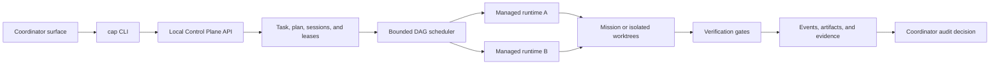

<div align="center">

# Cross Agent Control Plane

**A local, surface-neutral control plane for coordinating managed coding-agent runs.**

[English](./README.md) | [简体中文](./README.zh-CN.md)

</div>

Cross Agent Control Plane adds a versioned orchestration layer to the OpenHands Agent Canvas codebase. It lets a coordinator running in a terminal, desktop client, editor, or another surface publish a workflow, delegate bounded work to managed agent runtimes, verify the result, and record an explicit audit decision.

This is a community fork built on [OpenHands Agent Canvas](https://github.com/OpenHands/OpenHands). It is not an official OpenHands distribution. The upstream frontend and runtime integrations remain available, while the `control-plane/` modules provide the local orchestration path documented here.

## Why this exists

Coding-agent workflows often couple coordination to one UI, one model vendor, or one long-running shell. This project separates those concerns:

- The coordinator surface owns intent, review, and the final decision.
- The Control Plane owns tasks, sessions, leases, assignments, scheduling, events, and evidence.
- Managed runtimes perform narrowly scoped implementation work.
- Verification gates decide whether a run may reach review-ready state.
- Publishing credentials and repository writes remain outside worker prompts unless explicitly authorized.

The result is a local-first workflow that can use different agent runtimes without handing the entire repository lifecycle to any one model.

## Implemented capabilities

- **Surface-neutral coordination** — attach the current repository to a named coordinator surface. The fallback surface is `terminal`.
- **Versioned JSON workflows** — define task scope, acceptance criteria, verification gates, managed steps, and dependencies in a checked manifest.
- **Bounded DAG scheduling** — enforce concurrency limits, dependency fan-in, transitive failure blocking, and settlement of already-running independent siblings.
- **Workspace isolation** — choose `shared`, `mission`, `isolated`, or `auto` worktree policies according to the write boundary of each workflow.
- **Provider routing** — resolve ccSwitch provider/model routes into isolated per-session runtime configuration directories.
- **Hard verification gates** — run policy checks, tests, type checks, or other explicit commands before a run becomes review-ready.
- **Evidence and audit state** — persist events, artifacts, verification results, evidence bundles, and terminal decisions such as `accepted` or `changes_requested`.
- **Local state** — keep Control Plane state under `~/.cap` by default; override it with `CAP_DIR` when required.

## Architecture



The current terminal or client remains the coordinator. Managed workers do not receive GitHub credentials or publishing authority as part of the normal workflow.

## Prerequisites

- Node.js 22.12 or newer
- npm
- Git
- A supported external runtime and a configured ccSwitch route when a managed step uses one

The Control Plane itself is local and does not require a hosted service.

## Quick start

Install dependencies from the repository root:

```sh
npm install
```

Start the local daemon:

```sh
node control-plane/cap.mjs up
```

Attach the current repository to the terminal coordinator surface:

```sh
node control-plane/cap.mjs attach . --surface terminal
```

Create a workflow file such as `workflow.example.json`. Replace the provider and model placeholders with a route that exists in your local ccSwitch configuration:

```json
{
  "version": 1,
  "workspace": { "policy": "isolated" },
  "coordinator": { "mode": "current-session" },
  "limits": {
    "concurrency": 1,
    "max_duration_seconds": 1800,
    "inactivity_timeout_seconds": 600,
    "repeated_failure_limit": 1,
    "max_tokens": null,
    "max_cost_usd": null
  },
  "task": {
    "title": "Implement and verify a focused change",
    "scope": {
      "allow": ["src/**", "__tests__/**"],
      "deny": [".env", ".env.*"]
    },
    "acceptance": [
      {
        "criterion_id": "behavior",
        "statement": "The requested behavior is implemented and tested"
      }
    ],
    "verification": {
      "gates": [
        {
          "gate_id": "tests",
          "kind": "test",
          "required": true,
          "argv": ["npm", "test"],
          "parser": "none",
          "timeout_seconds": 600
        }
      ]
    }
  },
  "steps": [
    {
      "id": "implementation",
      "runtime": "claude-cli",
      "provider": {
        "source": "ccswitch",
        "id": "<provider-id>",
        "ccswitch_app_type": "claude",
        "provider_config_hash": "<pinned-provider-config-hash>",
        "billing_channel": "external-api"
      },
      "model": "<model-id>",
      "role": "Implementation",
      "responsibility": "Implement the requested change, run tests, and stop uncommitted.",
      "writes": true,
      "depends_on": [],
      "timeout_seconds": 1500,
      "workspace_policy": "isolated"
    }
  ]
}
```

Submit the workflow with a concrete goal:

```sh
node control-plane/cap.mjs run --workflow workflow.example.json "Implement the requested focused change"
```

Inspect or control the task:

```sh
node control-plane/cap.mjs status
node control-plane/cap.mjs logs <task-or-run-id> --follow
node control-plane/cap.mjs stop <task-or-run-id>
node control-plane/cap.mjs decide <task-id> --decision accepted
```

See the complete command reference in [docs/control-plane-cli.md](./docs/control-plane-cli.md).

## Workflow model

A workflow has two distinct execution roles:

1. **Coordinator steps** stay on the current trusted surface for planning, review, or decisions.
2. **Managed steps** are assigned to configured runtimes with pinned provider/model identity and an explicit workspace policy.

Dependencies form a directed acyclic graph. The scheduler launches only ready steps, never exceeds the declared concurrency limit, blocks all descendants of a failed step, and still waits for independent runs that were already active.

Successful execution is not the same as acceptance. Required gates must pass before a run reaches `review_ready`, and the coordinator records the terminal audit decision separately.

## Safety boundaries

- Keep credentials in the runtime/provider configuration, not in workflow prompts or committed files.
- Pin provider identity and configuration hashes for reproducible managed runs.
- Use explicit scope allowlists for workers with write intent.
- Prefer isolated or mission worktrees when multiple writers may exist.
- Treat commit, push, issue comments, and pull requests as separate publishing actions.
- Review the final diff and evidence before recording `accepted`.

## Verification

On macOS or Linux:

```sh
npm run test:control-plane
npm run typecheck
```

On Windows PowerShell or Windows Terminal:

```powershell
npm.cmd run test:control-plane
npm.cmd run typecheck
```

The Control Plane test suite covers workflow parsing, scheduling, worktree policies, runtime isolation, verification, evidence, audit decisions, cancellation, and failure handling.

## Repository layout

```text
control-plane/                 Control Plane CLI, API, scheduler, store, and runtime adapters
control-plane/tests/           Node-based Control Plane tests
docs/control-plane-cli.md      CLI command reference
specs/                         Versioned product and behavior specifications
src/                           Agent Canvas frontend
electron/                      Desktop application integration
```

## Status and limitations

- The project is under active development and should be treated as beta software.
- Workflow manifests are JSON; YAML manifests are intentionally rejected.
- Managed steps require a locally available runtime and a valid configured provider route.
- `cap up --overlay` accepts the flag, but the overlay UI is not yet implemented.
- The CLI and local daemon are the primary Control Plane interfaces today; editor and desktop surfaces can attach through the same surface identity model, but integrations may evolve.
- A coordinator-only workflow has no managed run to finalize, so practical automation workflows should include at least one managed step.

## Upstream and license

This repository builds on [OpenHands/OpenHands](https://github.com/OpenHands/OpenHands) and its Agent Canvas frontend. Refer to the upstream project for its broader agent platform, community, and documentation.

See [LICENSE](./LICENSE) for licensing terms. Contributions should preserve upstream attribution and clearly separate fork-specific behavior from upstream guarantees.
