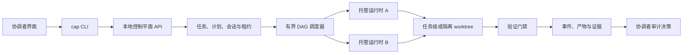

<div align="center">

# Cross Agent Control Plane

**一个用于协调托管式编程智能体任务的、本地优先且界面中立的控制平面。**

[English](./README.md) | [简体中文](./README.zh-CN.md)

</div>

Cross Agent Control Plane 在 OpenHands Agent Canvas 代码库之上增加了一层带版本的编排能力。运行在终端、桌面客户端、编辑器或其他界面中的协调者，可以发布工作流、把边界明确的任务交给托管智能体运行时、验证结果，并记录显式的审计决策。

这是一个基于 [OpenHands Agent Canvas](https://github.com/OpenHands/OpenHands) 构建的社区分支，并非 OpenHands 官方发行版。上游前端与运行时集成仍然保留，而本仓库的 `control-plane/` 模块提供本文档描述的本地编排路径。

## 为什么需要它

许多编程智能体工作流把协调过程绑定到单一界面、单一模型提供商或某个长期运行的终端。本项目将这些职责拆分开来：

- 协调者界面负责意图、复核与最终决策。
- 控制平面负责任务、会话、租约、分配、调度、事件与证据。
- 托管运行时只执行范围清晰的实现任务。
- 验证门禁决定运行是否能够进入待复核状态。
- 除非得到明确授权，发布凭据与仓库发布操作不会进入 worker 提示词。

这样可以形成一个本地优先的工作流：它能够组合不同的智能体运行时，同时不会把完整的仓库生命周期交给任意单一模型。

## 已实现能力

- **界面中立的协调方式**：把当前仓库附加到指定协调者界面；未指定时默认使用 `terminal`。
- **带版本的 JSON 工作流**：在经过校验的清单中定义任务范围、验收条件、验证门禁、托管步骤与依赖关系。
- **有界 DAG 调度**：执行并发上限、依赖汇合、失败的传递阻断，并等待已经运行的独立兄弟步骤完成收敛。
- **工作区隔离**：按照写入边界选择 `shared`、`mission`、`isolated` 或 `auto` worktree 策略。
- **提供商路由**：通过 ccSwitch 解析提供商与模型路由，并为每个会话生成隔离的运行时配置目录。
- **硬性验证门禁**：在运行进入待复核状态前，执行策略检查、测试、类型检查或其他显式命令。
- **证据与审计状态**：持久化事件、产物、验证结果、证据包，以及 `accepted`、`changes_requested` 等终态决策。
- **本地状态目录**：默认把控制平面状态保存在 `~/.cap`；需要时可通过 `CAP_DIR` 覆盖。

## 架构



当前终端或客户端始终保留协调者身份。正常工作流不会把 GitHub 凭据或发布权限交给托管 worker。

## 前置条件

- Node.js 22.12 或更高版本
- npm
- Git
- 当托管步骤需要外部智能体时，准备受支持的运行时以及已经配置好的 ccSwitch 路由

控制平面本身在本地运行，不依赖托管服务。

## 快速开始

在仓库根目录安装依赖：

```sh
npm install
```

启动本地守护进程：

```sh
node control-plane/cap.mjs up
```

把当前仓库附加到终端协调者界面：

```sh
node control-plane/cap.mjs attach . --surface terminal
```

创建一个工作流文件，例如 `workflow.example.json`。请把提供商与模型占位符替换为本机 ccSwitch 中真实存在的路由：

```json
{
  "version": 1,
  "workspace": { "policy": "isolated" },
  "coordinator": { "mode": "current-session" },
  "limits": {
    "concurrency": 1,
    "max_duration_seconds": 1800,
    "inactivity_timeout_seconds": 600,
    "repeated_failure_limit": 1,
    "max_tokens": null,
    "max_cost_usd": null
  },
  "task": {
    "title": "实现并验证一个聚焦改动",
    "scope": {
      "allow": ["src/**", "__tests__/**"],
      "deny": [".env", ".env.*"]
    },
    "acceptance": [
      {
        "criterion_id": "behavior",
        "statement": "请求的行为已经实现并具有测试覆盖"
      }
    ],
    "verification": {
      "gates": [
        {
          "gate_id": "tests",
          "kind": "test",
          "required": true,
          "argv": ["npm", "test"],
          "parser": "none",
          "timeout_seconds": 600
        }
      ]
    }
  },
  "steps": [
    {
      "id": "implementation",
      "runtime": "claude-cli",
      "provider": {
        "source": "ccswitch",
        "id": "<provider-id>",
        "ccswitch_app_type": "claude",
        "provider_config_hash": "<pinned-provider-config-hash>",
        "billing_channel": "external-api"
      },
      "model": "<model-id>",
      "role": "Implementation",
      "responsibility": "实现请求的改动、运行测试并以未提交状态停止。",
      "writes": true,
      "depends_on": [],
      "timeout_seconds": 1500,
      "workspace_policy": "isolated"
    }
  ]
}
```

使用一个明确目标提交工作流：

```sh
node control-plane/cap.mjs run --workflow workflow.example.json "实现请求的聚焦改动"
```

查看或控制任务：

```sh
node control-plane/cap.mjs status
node control-plane/cap.mjs logs <task-or-run-id> --follow
node control-plane/cap.mjs stop <task-or-run-id>
node control-plane/cap.mjs decide <task-id> --decision accepted
```

完整命令参考见 [docs/control-plane-cli.md](./docs/control-plane-cli.md)。

## 工作流模型

工作流包含两类不同的执行角色：

1. **协调者步骤**保留在当前可信界面中，用于规划、复核或决策。
2. **托管步骤**被分配给已经配置的运行时，并固定提供商、模型身份与工作区策略。

依赖关系组成一个有向无环图。调度器只启动已经满足条件的步骤，不会超过声明的并发上限；当步骤失败时会阻断它的全部后代，同时继续等待已经运行的独立任务结束。

执行成功并不等同于验收通过。运行必须先通过所有必需门禁才能进入 `review_ready`，之后由协调者单独记录最终审计决策。

## 安全边界

- 把凭据保存在运行时或提供商配置中，不要写入工作流提示词或已提交文件。
- 固定提供商身份与配置哈希，使托管运行具有可复现性。
- 为具有写入意图的 worker 配置显式范围白名单。
- 存在多个潜在写入者时，优先使用隔离或任务级 worktree。
- 把 commit、push、Issue 评论与 Pull Request 视为独立的发布操作。
- 在记录 `accepted` 前复核最终 diff 与证据。

## 验证

在 macOS 或 Linux 上：

```sh
npm run test:control-plane
npm run typecheck
```

在 Windows PowerShell 或 Windows Terminal 上：

```powershell
npm.cmd run test:control-plane
npm.cmd run typecheck
```

控制平面测试覆盖工作流解析、调度、worktree 策略、运行时隔离、验证、证据、审计决策、取消与失败处理。

## 仓库结构

```text
control-plane/                 控制平面 CLI、API、调度器、存储与运行时适配器
control-plane/tests/           基于 Node 的控制平面测试
docs/control-plane-cli.md      CLI 命令参考
specs/                         带版本的产品与行为规范
src/                           Agent Canvas 前端
electron/                      桌面应用集成
```

## 当前状态与限制

- 项目仍在持续开发中，应当按 beta 软件对待。
- 工作流清单使用 JSON；YAML 会被明确拒绝。
- 托管步骤需要本机存在相应运行时，并且提供商路由配置有效。
- `cap up --overlay` 可以接收该参数，但 overlay UI 尚未实现。
- 当前主要接口是 CLI 与本地守护进程；编辑器和桌面界面可以使用相同的界面身份模型附加，但相关集成仍可能变化。
- 只有协调者步骤的工作流不存在可供 finalize 的托管运行，因此实际自动化工作流应至少包含一个托管步骤。

## 上游与许可证

本仓库构建于 [OpenHands/OpenHands](https://github.com/OpenHands/OpenHands) 及其 Agent Canvas 前端之上。关于更完整的智能体平台、社区与文档，请参考上游项目。

许可证条款见 [LICENSE](./LICENSE)。贡献内容应保留上游归属，并明确区分本分支特有行为与上游保证。
