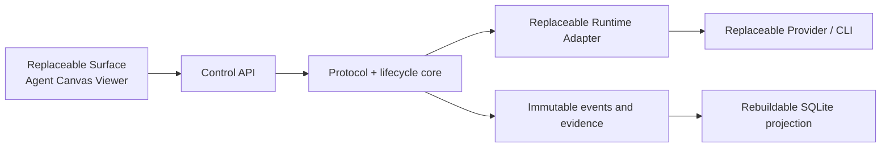

# Cross-Agent Control Plane v1

This repository is an OpenHands Agent Canvas fork with an independently replaceable control-plane service. The UI is a Surface, runtime CLIs are adapters, and immutable protocol records are the product boundary.

## What v1 provides

- Versioned `TaskSpec`, normalized `AgentEvent`, sealed `EvidenceBundle`, `AuditDecision`, and `CorrectionDelta` records.
- Planner/Worker/Verifier/Auditor lifecycle boundaries without coupling the protocol to one UI, runtime, or model provider.
- One isolated Git worktree per run, exact base-commit checks, scope enforcement, deterministic verification gates, zero-test false-green protection, process-tree cancellation, and stale-lease recovery.
- File-backed immutable authority plus a rebuildable SQLite query projection.
- Windows-first process ownership and cancellation.
- A local control API and a read-only Agent Canvas Viewer at `/control-plane`.
- Explicit model identity: requested and expected values in `RunContext`, actual observed model in normalized events and the evidence bundle. A mismatch fails the run.

## Boundaries



The control plane does not infer success from process exit code alone. A run needs a credible terminal runtime result, an allowed model identity, in-scope changes, required verification gates, and a sealed evidence bundle before it reaches `review_ready`.

## Local use

Start the normal stack. The launcher starts the control plane on the shared default port and proxies it under `/api/control-plane`.

```powershell
npm run start
```

Run the service by itself:

```powershell
node control-plane/cli.mjs serve --state .control-plane --port 18002
```

Create a task and run the deterministic local fixture runtime:

```powershell
node control-plane/cli.mjs create-task --state .control-plane --file examples/control-plane/task-spec.example.json
node control-plane/cli.mjs run --state .control-plane --task <task_id> --revision 1 --repo <repository> --runtime fake
```

Verification:

```powershell
npm run test:control-plane
npm run typecheck
npm run build
```

## State layout

The default state root is `~/.openhands/agent-canvas/control-plane`.

- `tasks/<task>/revisions/*.json` and `state.json`
- `runs/<run>/run-context.json`, `state.json`, `events.ndjson`, artifacts, verification results, and `evidence-bundle.json`
- `decisions/*.json`
- `corrections/*.json`
- `index.sqlite`, which can be rebuilt from the files
- `worktrees/<run>/`, retained for review instead of being destructively removed

## Honest v1 limitations

- The fake runtime is the only runtime exercised end to end in this implementation session. Claude CLI and Codex CLI adapters have fixture-level normalization tests only; no external model was invoked.
- The Viewer is intentionally read-only. Task creation, run start/cancel, audit decisions, corrections, and index rebuild are control API operations.
- Provider selection, credentials, approvals, and rich interactive sessions remain adapter concerns.
- Long-term routing from real execution history is not trained in v1. The event/evidence schema preserves the raw inputs needed for later routing, quality, cost, and reliability models.
- Commit, merge, push, publish, and discard remain human-gated protocol actions.
